# DeepASMR GAN 😴
**Aiffel Mini-Hackerton <10.13 ~ 10.15>**
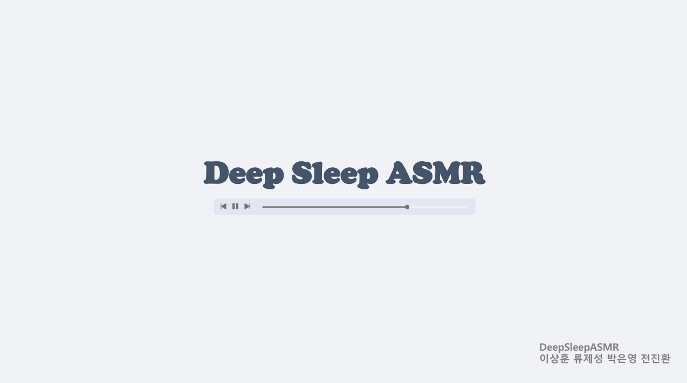 </img>
 </img>


## 프로젝트 요약 

### *completed*

- [데이터 정의](#data-definition)
- [데이터 수집](#data-collection)
- [데이터 전처리](#data-preprocessing)
- [생성 모델 구축](#generative-model)
- [음원 생성 및 결과](#result)
- [공공 빅데이터 공모전 PPT 제출](#competition) 
---
### *In-progress*

- 장르 분류 모델 구축
-  장르 분류 결과 시각화(클러스터링)
-  웹 어플리케이션 제작
-  데이터베이스 구축
-  MIDI 데이터 확보 및 음원 생성
-  오디오 결합 및 합성(Audio Concatenation & Synthesis)
---

 ## [Data Definition]()

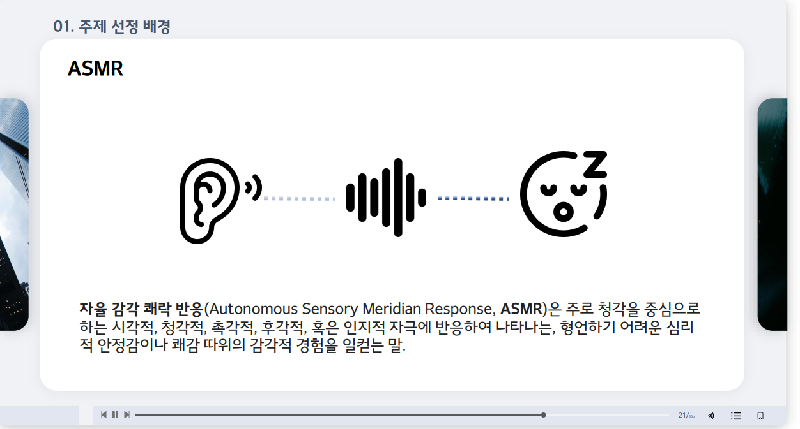 </img>


### `ASMR Attributes`
```
1. id - asmrID
2. author - 영상 제작자명
3. title - 저장할 파일명
4. channel_url - 영상 URL
5. publish_date - 영상 업로드일
6. genre -  {nature, mix, tap}으로 구분 
7. comment - 말소리 포함 유무 {포함:1, 미포함: 0}
8. file_size - 파일 크기
9. genre_keyword - 장르에 대한 추가적인 정보
10. description - 영상 설명
```

### `Youtube`
```
ex)
URL: GET,
/api/asmr/{asmrId}/youtube/

{
    data : {
        "id": 1,
        "author": "카민Carmine",
        "title": "yt_nature_fire_20180619",
        "channel_url": "https://www.youtube.com/watch?v=2TrgSww4Wf8&t=8s",
        "publish_date": "20180619",
        "genre": "nature",
        "comment": "0",
        "file_size": "2147483",
        "genre_keyword": "fire",
        "description": "🔥 공부할 때 듣는 장작 타는 소리 / Fireplace sound"
    }
}
```
---

### `Public Data`

```
ex)
URL: GET,
/api/asmr/{asmrId}/public/

{
    data : {
        "id": 2,
        "author": "국립공원공단",
        "title": "pb_nature_snow_20191231"
        "channel_url": "http://s3-asia-east.amazonaws.com/asmr/1",
        "publish_date": "20191231",
        "genre": "nature",
        "comment": "0",
        "file_size": "100000",
        "genre_keyword": "snow",
        "description": "자연치유동영상_덕유산등산로눈밟는소리"
    }
}
```
---
## [Data Collection]()
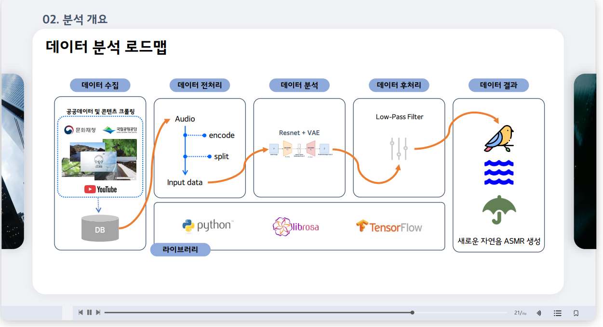 </img>

*데이터 크롤링*
- Youtube 데이터를 수집하기 위해 `pytube` 라이브러리를 사용하여 원하는 영상의 url을 받아 `mp4` 파일을 다운받을 수 있게 기능을 구현
- 오디오 데이터 전처리를 위해 `pydub`와 `ffmpeg` 라이브러리를 사용
- 고음질로의 변환을 위해 `mp4` 포맷에서 `wav` 포맷으로 변경
- [공공데이터 포털](https://www.data.go.kr/)의 ASMR 데이터 총 94개 확보 (앞부분 인트로 5초 제거 완료)  
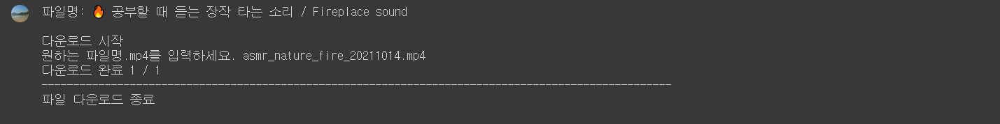 </img>

---
## [Data Preprocessing]()
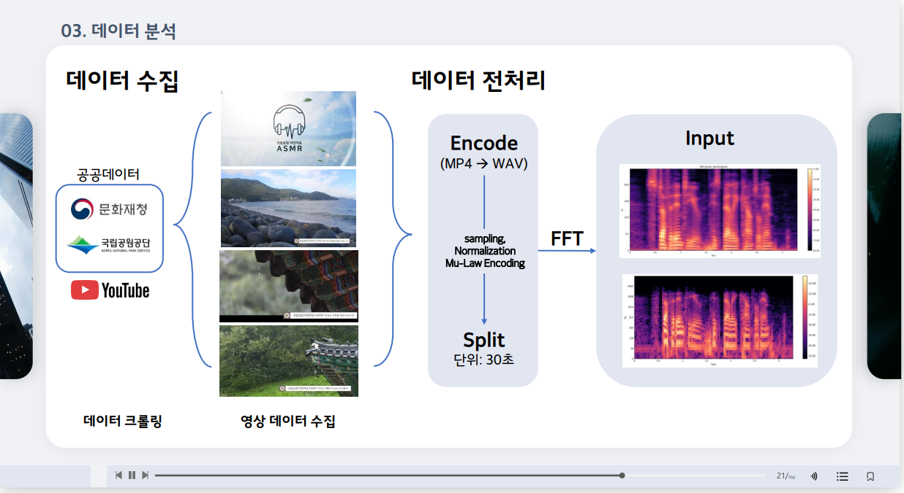 </img>

*참고 노트북*

- [1. Audio Processing](https://github.com/ithingv/ai_study/blob/main/Deep_Learning/Speech/Audio_Processing.ipynb)
- [2. Audio Classification](https://github.com/ithingv/ai_study/blob/main/Deep_Learning/Speech/Audio_Classification.ipynb)
- [3. Speech Synthesis](https://github.com/ithingv/ai_study/blob/main/Deep_Learning/Speech/Speech%20Synthesis.ipynb)


*데이터 전처리 프로세스*
```
# 이번 미니 해커톤 프로젝트에서는 1차원 sequence 데이터를 활용하여 음원을 생성하였음
1. mp4 -> wav
2. duration = 30초 단위로 데이터 chunk
3. sampling rate = 22500로 설정
4. Input: 1D Sequence (dtype=numpy.float32)

# 2D 멜스펙트로그램 변환시
1. mp4 -> wav
2. duration = 30초 단위로 데이터 chunk 
3. Sampling, Normalization, Mu-Law Encoding
4. Fast Fourier Transform 
5. Input: Melspectrogram(2D)
```
---
## [Generative Model]()


### Model List
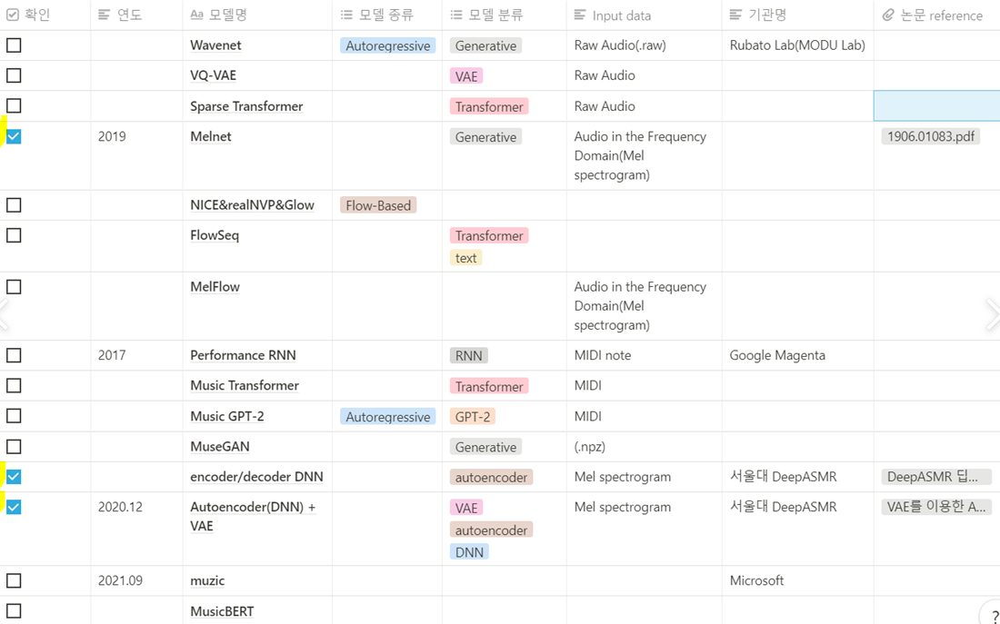 </img>

---

### 프로젝트에 사용한 최종 모델 ---> `Resnet + VAE`
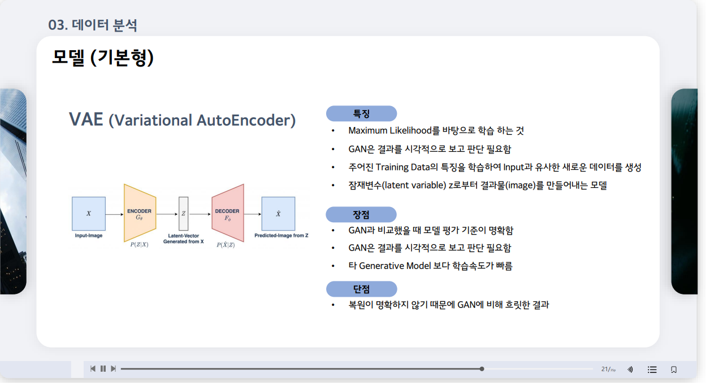 </img>
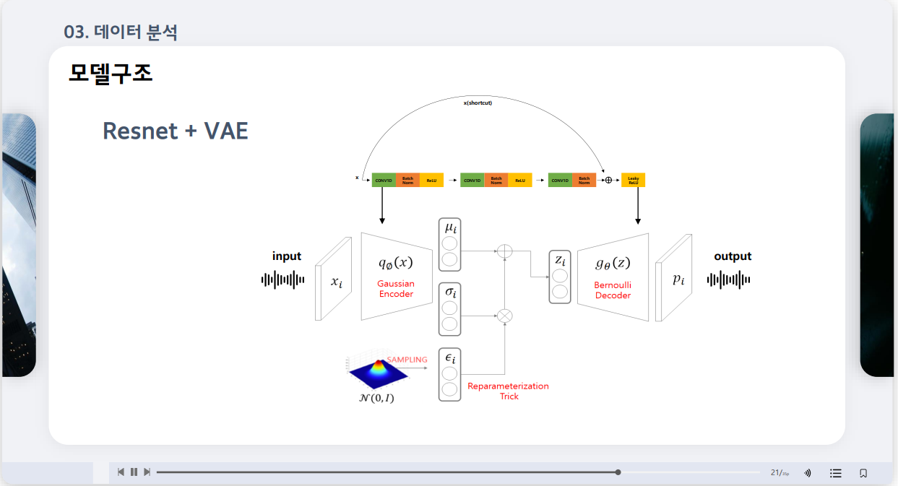 </img>


# `Resnet`
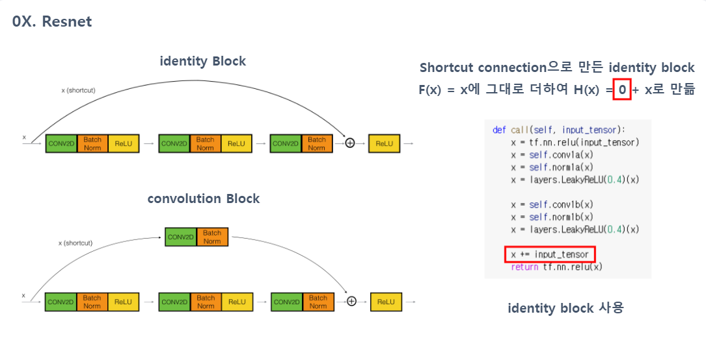 </img>

```
class Resnet1DBlock(tf.keras.Model):
    def __init__(self, kernel_size, filters,type='encode'):
        super(Resnet1DBlock, self).__init__(name='')
    
        if type=='encode':
            self.conv1a = layers.Conv1D(filters, kernel_size, 2,padding="same")
            self.conv1b = layers.Conv1D(filters, kernel_size, 1,padding="same")
            self.norm1a = tfa.layers.InstanceNormalization()
            self.norm1b = tfa.layers.InstanceNormalization()
        if type=='decode':
            self.conv1a = layers.Conv1DTranspose(filters, kernel_size, 1,padding="same")
            self.conv1b = layers.Conv1DTranspose(filters, kernel_size, 1,padding="same")
            self.norm1a = tf.keras.layers.BatchNormalization()
            self.norm1b = tf.keras.layers.BatchNormalization()
        else:
            return None

    def call(self, input_tensor):
        x = tf.nn.relu(input_tensor)
        x = self.conv1a(x)
        x = self.norm1a(x)
        x = layers.LeakyReLU(0.4)(x)

        x = self.conv1b(x)
        x = self.norm1b(x)
        x = layers.LeakyReLU(0.4)(x)

        x += input_tensor
        return tf.nn.relu(x)
```

---
# `VAE`

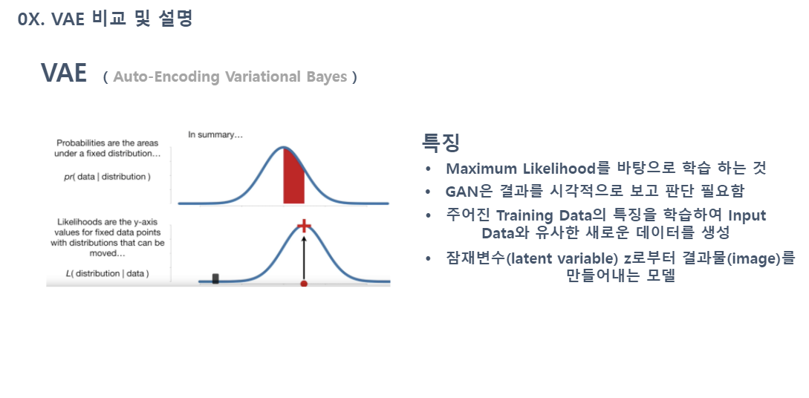 </img>
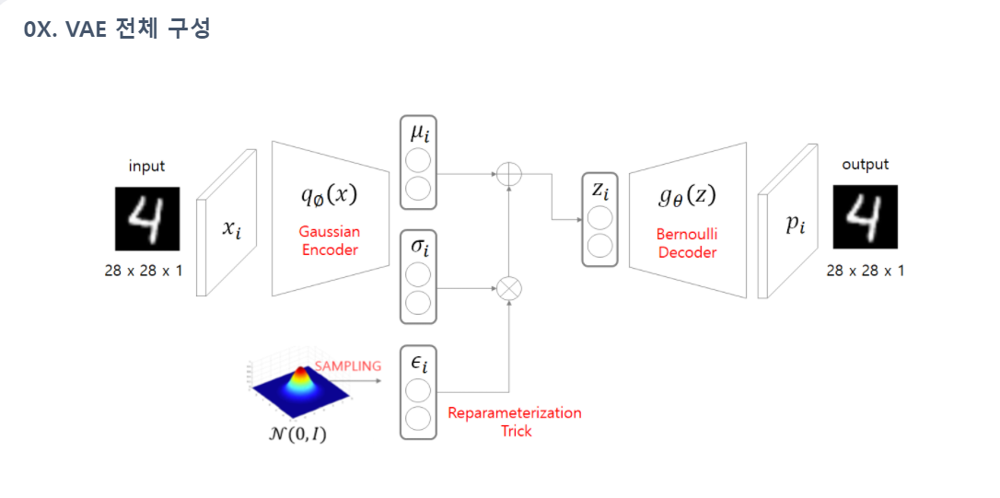 </img>

```
class CVAE(tf.keras.Model):

    def __init__(self, latent_dim):
        super(CVAE, self).__init__()
        self.latent_dim = latent_dim
        self.encoder = tf.keras.Sequential(
            [
                tf.keras.layers.InputLayer(input_shape=(1,22500*30)),# 90001
                layers.Conv1D(64,1,2),
                Resnet1DBlock(64,1),
                layers.Conv1D(128,1,2),
                Resnet1DBlock(128,1),
                layers.Conv1D(128,1,2),
                Resnet1DBlock(128,1),
                layers.Conv1D(256,1,2),
                Resnet1DBlock(256,1),
                # No activation
                layers.Flatten(),
                layers.Dense(latent_dim+latent_dim)

            ]
        )
        self.decoder = tf.keras.Sequential(
            [
                tf.keras.layers.InputLayer(input_shape=(latent_dim,)),
                layers.Reshape(target_shape=(1,latent_dim)),
                Resnet1DBlock(512,1,'decode'),
                layers.Conv1DTranspose(512,1,1),
                Resnet1DBlock(256,1,'decode'),
                layers.Conv1DTranspose(256,1,1),
                Resnet1DBlock(128,1,'decode'),
                layers.Conv1DTranspose(128,1,1),
                Resnet1DBlock(64,1,'decode'),
                layers.Conv1DTranspose(64,1,1),
                # No activation
                layers.Conv1DTranspose(22500*30,1,1), #90001
            ]
        )

    @tf.function
    def sample(self, eps=None):
        if eps is None:
            eps = tf.random.normal(shape=(200, self.latent_dim))
        return self.decode(eps, apply_sigmoid=True)

    @tf.function
    def encode(self, x):
        mean, logvar = tf.split(self.encoder(x), num_or_size_splits=2, axis=1)
        return mean, logvar

    @tf.function
    def reparameterize(self, mean, logvar):
        eps = tf.random.normal(shape=mean.shape)
        return eps * tf.exp(logvar * .5) + mean

    @tf.function
    def decode(self, z, apply_sigmoid=False):
        logits = self.decoder(z)
        if apply_sigmoid:
            probs = tf.sigmoid(logits)
            return probs
        return logits

    @tf.function
    def log_normal_pdf(sample, mean, logvar, raxis=1):
        log2pi = tf.math.log(2. * np.pi)
        return tf.reduce_sum(
             -.5 * ((sample - mean) ** 2. * tf.exp(-logvar) + logvar + log2pi),axis=raxis)

    @tf.function
    def compute_loss(model, x):
        mean, logvar = model.encode(x)
        z = model.reparameterize(mean, logvar)
        x_logit = model.decode(z)
        cross_ent = tf.nn.sigmoid_cross_entropy_with_logits(logits=x_logit, labels=x)
        logpx_z = -tf.reduce_sum(cross_ent, axis=[1,2])
        logpz = log_normal_pdf(z, 0., 0.)
        logqz_x = log_normal_pdf(z, mean, logvar)
        return -tf.reduce_mean(logpx_z + logpz - logqz_x)
```
---
## [Result]()
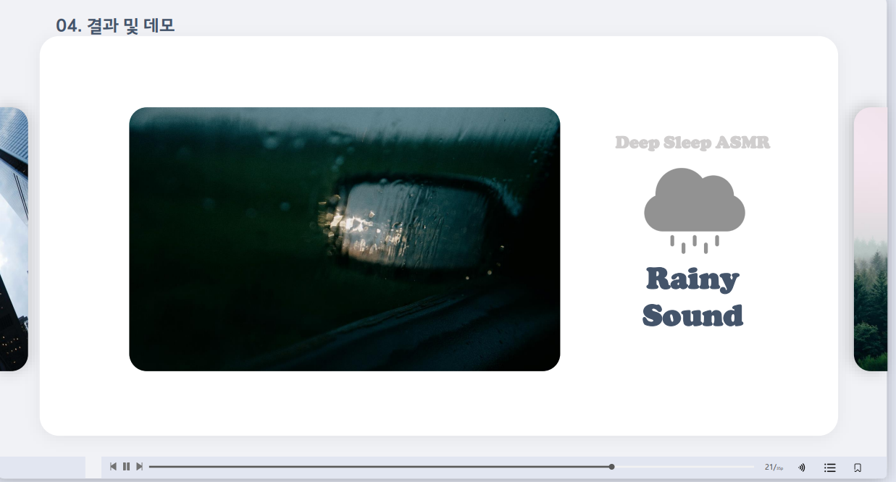 </img>

빗소리 음원 생성결과 url: https://www.notion.so/1d04da9a35d943ec93b52716e6b7c4ef

---
## [Competition](#competition)
 </img>
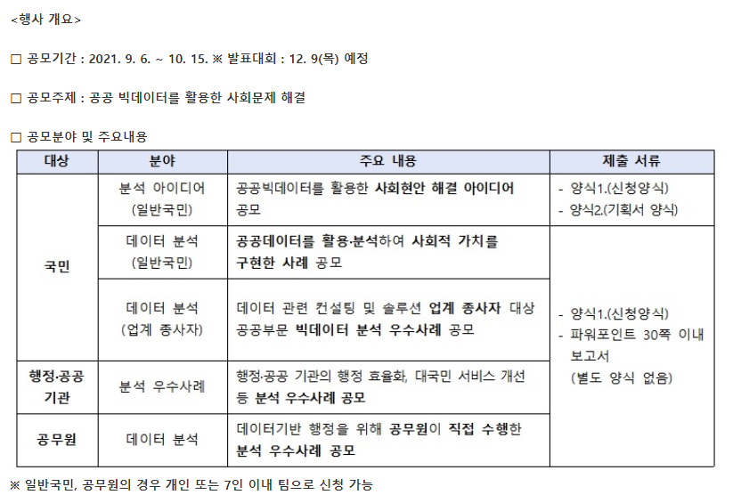 </img>

- 홈페이지 : https://www.data.go.kr/bbs/ntc/selectNotice.do?pageIndex=1&originId=NOTICE_0000000002205&atchFileId=
- 2021년 공공빅데이터 분석 공모전 공모(~10.15) 지원서 접수 완료
- [최종 제출 지원서 pdf](./docs/ASMR.pdf)


